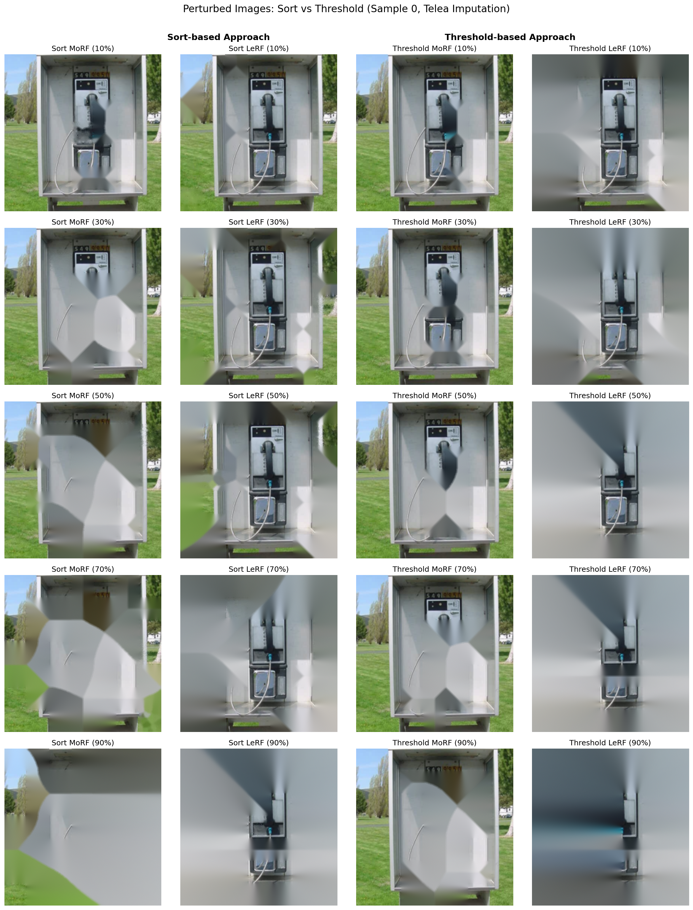

<p align="center">
  
</p>

## Conda environment & requirements ✅

Create and activate a conda environment, then install Python requirements used by the project.

Quick (automated) setup:

```bash
# Create env and install requirements (uses mamba if available):
./setup_conda.sh road_imputation 3.10

# Then activate and use it:
conda activate road_imputation
```

Manual steps:

```bash
# Create environment (choose desired Python version):
conda create -n road_imputation python=3.10 -y
conda activate road_imputation

# Upgrade pip and install requirements
python -m pip install --upgrade pip setuptools wheel
pip install -r requirements.txt
# Optional: runtime-only requirements
if [ -f requirements_running.txt ]; then pip install -r requirements_running.txt; fi

# Optional: make the env available to Jupyter
python -m ipykernel install --user --name=road_imputation --display-name "road_imputation"
```

If you prefer, use `mamba` instead of `conda` for faster environment creation.

## Running Experiments

### Using the Bash Script

We provide a convenient bash script to run ROAD benchmark experiments on CIFAR-10, CIFAR-100, and ImageNet datasets.

**Basic Usage:**
```bash
# Run all datasets with default 10 test samples
./run_road_experiments.sh

# Run specific dataset
./run_road_experiments.sh cifar10
./run_road_experiments.sh cifar100
./run_road_experiments.sh imagenet

# Run with custom sample size
./run_road_experiments.sh cifar10 100
./run_road_experiments.sh all 50

# Show help
./run_road_experiments.sh --help
```

**Configuration:**
The script runs the following by default:
- **Imputations:** linear, telea, ns (Noisy Linear, OpenCV Telea, OpenCV Navier-Stokes)
- **Rankings:** sort, threshold
- **Stages:** explain, benchmark, analyze

### Using Python Commands

You can also run experiments directly via Python:

```bash
# CIFAR-10
cd /path/to/road_imputation && \
PYTHONPATH=$(pwd) python -m experiments.unified.run_pipeline \
  --dataset cifar10 \
  --imputations linear telea ns \
  --rankings sort threshold \
  --stages explain benchmark analyze \
  --test_subset_size 100 \
  --output_dir ./output

# CIFAR-100
PYTHONPATH=$(pwd) python -m experiments.unified.run_pipeline \
  --dataset cifar100 \
  --data_path /path/to/cifar100/data \
  --imputations linear telea ns \
  --rankings sort threshold \
  --stages explain benchmark analyze \
  --test_subset_size 100 \
  --output_dir ./output

# ImageNet
PYTHONPATH=$(pwd) python -m experiments.unified.run_pipeline \
  --dataset imagenet \
  --data_path /path/to/imagenet/data \
  --imputations linear telea ns \
  --rankings sort threshold \
  --stages explain benchmark analyze \
  --test_subset_size 50 \
  --output_dir ./output
```

### Output Structure

Results are saved to `./output/{dataset}/`:
- `explanations/` - Generated attribution maps
- `results/noretrain.json` - Benchmark results
- `tables/` - Generated analysis tables (Spearman correlations, accuracy tables)

### Analysis Notebooks

- `Full_ROAD_Pipeline_Analysis.ipynb` - Load results and compute Spearman rank correlations
- `GradCAM_ImageNet_ROAD_Experiment.ipynb` - Interactive GradCAM + ROAD demo on ImageNet

